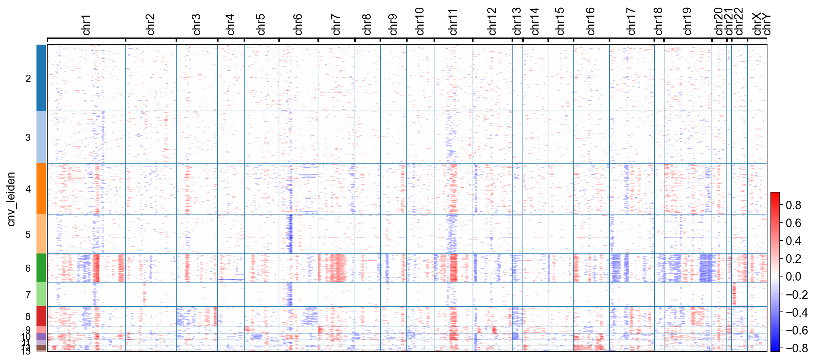

# infercnvpy: Scanpy plugin to infer copy number variation (CNV) from single-cell transcriptomics data

[![Tests][badge-tests]][link-tests]
[![Documentation][badge-docs]][link-docs]
[![PyPI][badge-pypi]][link-pypi]

[badge-tests]: https://github.com/icbi-lab/infercnvpy/actions/workflows/test.yaml/badge.svg
[link-tests]: https://github.com/icbi-lab/infercnvpy/actions/workflows/test.yml
[badge-docs]: https://img.shields.io/readthedocs/infercnvpy
[badge-pypi]: https://img.shields.io/pypi/v/infercnvpy?logo=PyPI
[link-pypi]: https://pypi.org/project/infercnvpy/

Infercnv is a scalable python library to infer copy number variation (CNV) events from single cell transcriptomics data. It is heavliy inspired by [InferCNV][], but plays nicely with [scanpy][] and is much more scalable.

[infercnv]: https://github.com/broadinstitute/inferCNV/wiki
[scanpy]: https://scanpy.readthedocs.io/en/stable/index.html



**WARNING**:

**This package is still experimental. The results have not been validated,
except in that they look similar, but not identical, to the results of InferCNV.**

**We are happy about feedback and welcome contributions!**

## Getting started

Please refer to the [documentation][link-docs]. In particular, the

- [API documentation][link-api].

## Installation

You need to have Python 3.10 or newer installed on your system. If you don't have
Python installed, we recommend installing [Mambaforge](https://github.com/conda-forge/miniforge#mambaforge).

There are several alternative options to install infercnvpy:

1. Install the latest release of `infercnvpy` from `PyPI <https://pypi.org/project/infercnvpy/>`\_:

```bash
pip install infercnvpy
```

2. Install the latest development version:

```bash
pip install git+https://github.com/icbi-lab/infercnvpy.git@main
```

To (optionally) run the `copyKAT` algorithm, you need a working R installation
and the [copykat][] package installed. Usually, if `R` is in your `PATH`, [`rpy2`][rpy2] automatically
detects your R installation. If you get an error message while importing `infercnvpy`,
try setting the `R_HOME` environment variable before importing infercnvpy:

```python
import os

os.environ["R_HOME"] = "/usr/lib/R"
import infercnvpy
```

[copykat]: https://github.com/navinlabcode/copykat#step-1-installation
[rpy2]: https://rpy2.github.io/

## Release notes

See the [changelog][changelog].

## Contact

For questions and help requests, you can reach out in the [scverse discourse][scverse-discourse].
If you found a bug, please use the [issue tracker][issue-tracker].

## Citation

n/a

[scverse-discourse]: https://discourse.scverse.org/
[issue-tracker]: https://github.com/icbi-lab/infercnvpy/issues
[changelog]: https://infercnvpy.readthedocs.io/latest/changelog.html
[link-docs]: https://infercnvpy.readthedocs.io/
[link-api]: https://infercnvpy.readthedocs.io/en/latest/api.html
